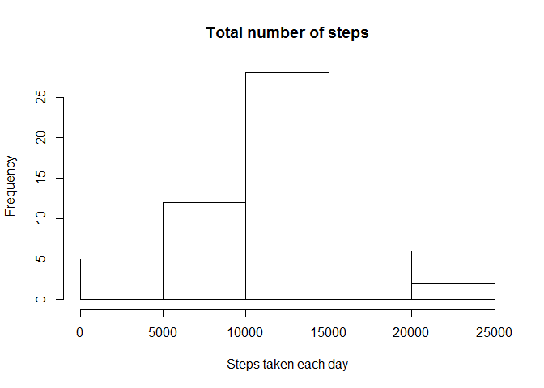
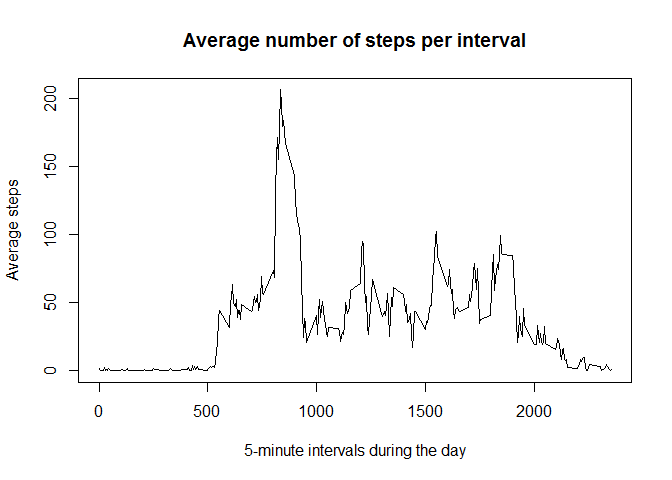
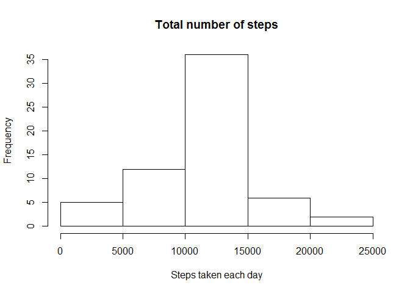
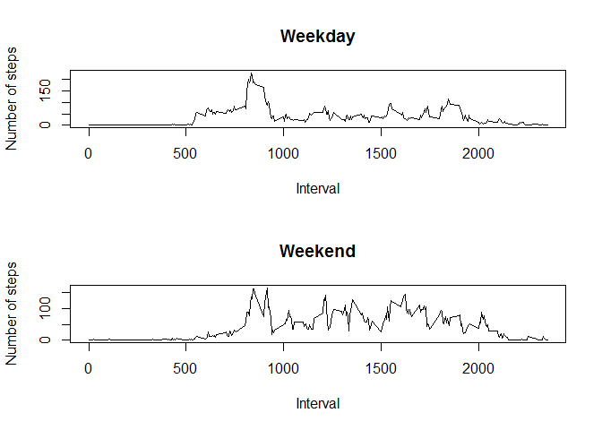

# Reproducible Research: Peer Assessment 1


## Loading and preprocessing the data

1. Read the file, no additional preprocessing is need


```r
activity_file <- unzip("activity.zip")
activity_dat <- read.csv(activity_file)
```


## What is mean total number of steps taken per day?  

1. Calculate the total number of steps per day.


```r
library(dplyr,quietly=TRUE)
```

```
## Warning: package 'dplyr' was built under R version 3.1.3
```

```
## 
## Attaching package: 'dplyr'
## 
## The following object is masked from 'package:stats':
## 
##     filter
## 
## The following objects are masked from 'package:base':
## 
##     intersect, setdiff, setequal, union
```

```r
steps_dat <- summarize(group_by(activity_dat, date), total = sum(steps))
```

2. Plot the histogram of the total number of steps taken each day


```r
hist(steps_dat$total, main = paste("Total number of steps"), xlab = "Steps taken each day")
```

 

3. Calculate and report the mean and median of the total number of steps taken per day


```r
mean(steps_dat$total,na.rm=TRUE)
```

```
## [1] 10766.19
```

```r
median(steps_dat$total,na.rm=TRUE)
```

```
## [1] 10765
```


## What is the average daily activity pattern?

1. Make a time series plot (i.e. type = "l") of the 5-minute interval (x-axis) and the average number of steps taken, averaged across all days (y-axis).


```r
avg_steps_dat <- summarize(group_by(activity_dat, interval), avg = mean(steps, na.rm=TRUE))
plot(avg_steps_dat, main = paste("Average number of steps per interval"), ylab = "Average steps", xlab = "5-minute intervals during the day", type="l")
```

 

2. Which 5-minute interval, on average across all the days in the dataset, contains the maximum number of steps?


```r
max_interval <- avg_steps_dat[which.max(avg_steps_dat$avg),]
max_interval
```

```
## Source: local data frame [1 x 2]
## 
##   interval      avg
## 1      835 206.1698
```
The "835" 5-minute interval has the maximum number of steps.


## Imputing missing values

1. Calculate and report the total number of missing values in the dataset (i.e. the total number of rows with NAs)


```r
sum(is.na(activity_dat$steps))
```

```
## [1] 2304
```

2. Devise a strategy for filling in all of the missing values in the dataset. 

Use the mean for each 5-minute interval arrived at after calculating it for all the days across the dataset (use avg_steps_dat from above).

3. Create a new dataset that is equal to the original dataset but with the missing data filled in.


```r
new_activity_dat <- activity_dat
new_activity_dat[is.na(new_activity_dat$steps),1] <- avg_steps_dat[,2]
```

4. Make a histogram of the total number of steps taken each day and Calculate and report the mean and median total number of steps taken per day. Do these values differ from the estimates from the first part of the assignment? What is the impact of imputing missing data on the estimates of the total daily number of steps?


```r
new_steps_dat <- summarize(group_by(new_activity_dat, date), total = sum(steps))
hist(new_steps_dat$total, main = paste("Total number of steps"), xlab = "Steps taken each day")
```

 

```r
mean(new_steps_dat$total)
```

```
## [1] 10766.19
```

```r
median(new_steps_dat$total)
```

```
## [1] 10766.19
```

The calculated values arrived at after imputing missing data on the estimates of the total daily number of steps are almost identical to the values calculated without imputing the missing values.


## Are there differences in activity patterns between weekdays and weekends?

1. Create a new factor variable in the dataset with two levels - "weekday" and "weekend" indicating whether a given date is a weekday or weekend day.


```r
new_activity_dat <- mutate(new_activity_dat, Day = !(weekdays(as.Date(new_activity_dat[,2])) == "Saturday" | weekdays(as.Date(new_activity_dat[,2])) == "Sunday"))
new_activity_dat[new_activity_dat[,4] == TRUE,4] <- "Weekday"
new_activity_dat[new_activity_dat[,4] == FALSE,4] <- "Weekend"
```

2. Make a panel plot containing a time series plot (i.e. type = "l") of the 5-minute interval (x-axis) and the average number of steps taken, averaged across all weekday days or weekend days (y-axis). See the README file in the GitHub repository to see an example of what this plot should look like using simulated data.


```r
weekday_dat <- filter(new_activity_dat, Day == "Weekday")
weekend_dat <- filter(new_activity_dat, Day == "Weekend")
weekday_avg_steps_dat <- summarize(group_by(weekday_dat, interval), avg = mean(steps))
weekend_avg_steps_dat <- summarize(group_by(weekend_dat, interval), avg = mean(steps))

op <- par(mfrow = c(2, 1))
plot(weekday_avg_steps_dat, main = paste("Weekday"), ylab = "Number of steps", xlab = "Interval", type="l")
plot(weekend_avg_steps_dat, main = paste("Weekend"), ylab = "Number of steps", xlab = "Interval", type="l")
```

 

```r
par(op)
```

